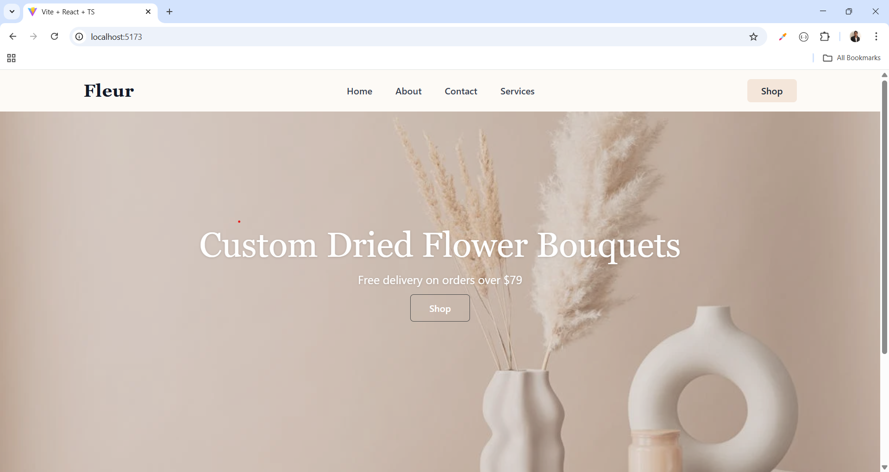
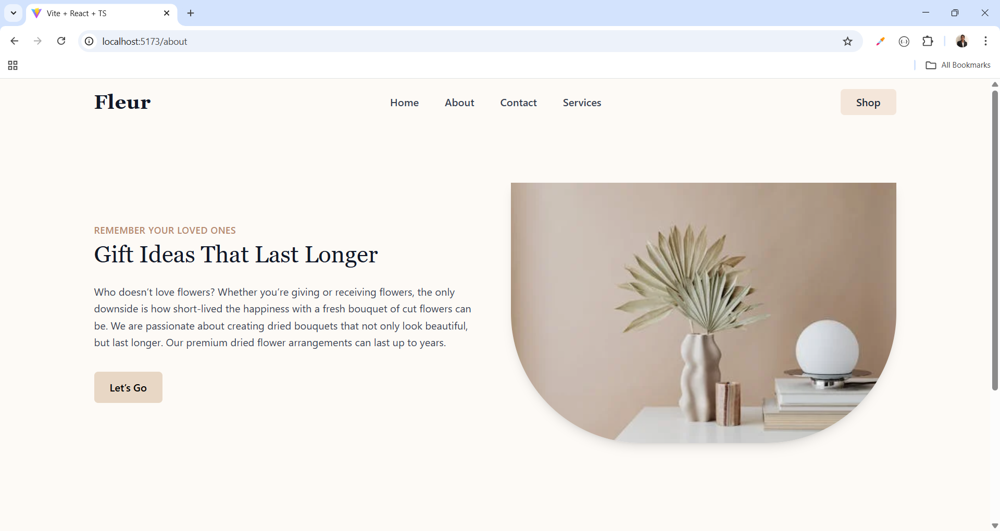
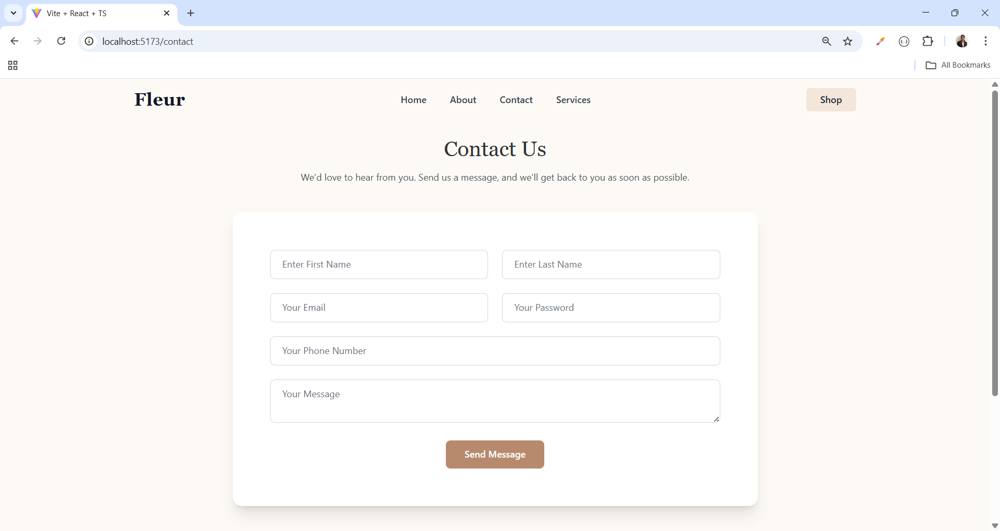
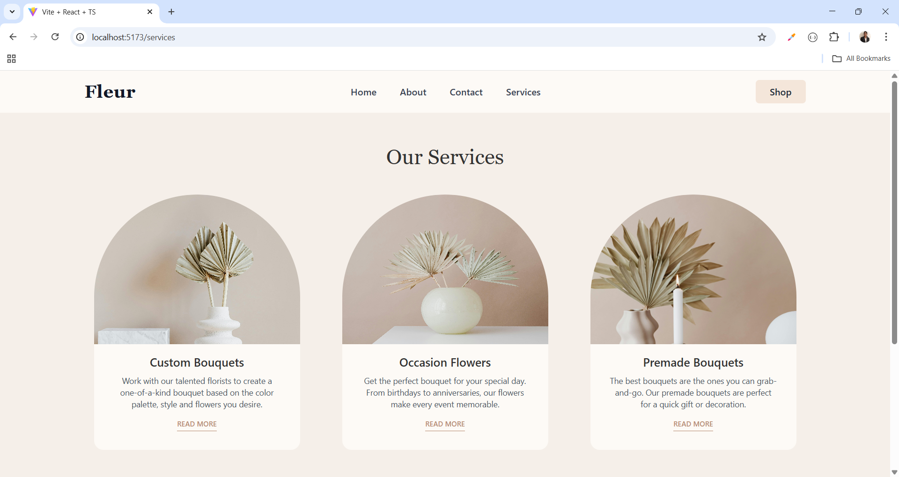
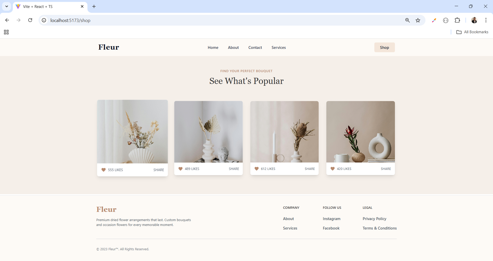
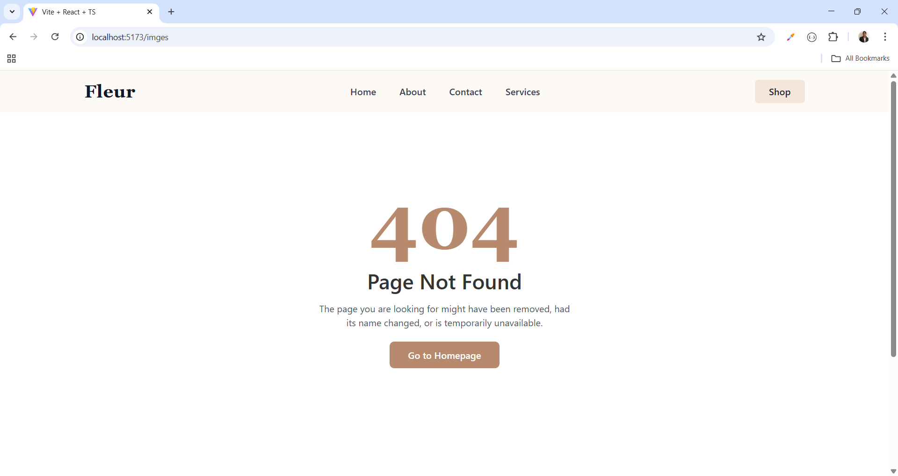

# 🌸 Fleur – Custom Dried Flower Bouquets Website

A modern and elegant **React + Tailwind CSS** website for a dried flower shop, featuring a homepage, about section, services, blog, shop, and a 404 error page.

---

## 📌 Features

### 1. **Responsive Navbar**
- Logo linking to home.
- Navigation links: Home, About, Services, Contact.
- Shop button with hover effect.
- Mobile-friendly layout with Tailwind CSS classes.

### 2. **Homepage Banner**
- Full-screen hero section with a background image.
- Text overlay with headline, subtext, and **Shop** CTA button.
- Semi-transparent overlay for better text readability.
- Drop shadows for improved contrast.

### 3. **About Section**
- Split layout with text on the left and image on the right.
- Headline, tagline, description, and **Let's Go** button.
- Rounded image with shadow effects.
- Responsive design for all devices.

### 4. **Services Section**
- Three cards: **Custom Bouquets**, **Occasion Flowers**, **Premade Bouquets**.
- Rounded top images with overflow hidden.
- Description, headline, and **Read More** button for each card.
- Flex layout adjusts from column (mobile) to row (desktop).

### 5. **Shop Section**
- Grid layout with 1–4 columns depending on screen size.
- Product cards with image, likes, and share button.
- Hover effect scales cards slightly.
- Premium and clean UI for displaying products.

### 6. **Blog Page**
- Simple page with centered heading.
- Ready to add blog content.

### 7. **404 Error Page**
- Full-screen layout for Page Not Found.
- Heading with **404**, description, and button to redirect to homepage.
- Elegant design with branding colors.

---

## 🎨 Design
- **Tailwind CSS** for modern, responsive styling.
- Soft color palette: `#fdfaf6`, `#F5EFE9`, `#b78a6e`.
- Rounded corners, shadows, and hover animations for interactive elements.
- Mobile-first responsive design using Tailwind's breakpoints.

---

## 🛠️ Tech Stack

- **React** – Component-based UI
- **React Router DOM** – Navigation
- **Tailwind CSS** – Styling
- **JavaScript ES6+**
- **Responsive Design** – Mobile, tablet, desktop

## 🔗 Social Links

- [💼 LinkedIn](https://www.linkedin.com/in/nency-vadadoriya-3969052ba/)
- [👨‍💻 GitHub](https://github.com/nencyvadadoriya)

---

## 🪪 License

This project is licensed under the [MIT License](https://github.com/nencyvadadoriya/-License/blob/main/LICENSE).

---
📸 Preview

<table>
  <tr>
    <td></td>
    <td></td>
  </tr>
  <tr>
    <td></td>
    <td></td>
  </tr>
  <tr>
    <td></td>
    <td></td>
  </tr>
</table>

---