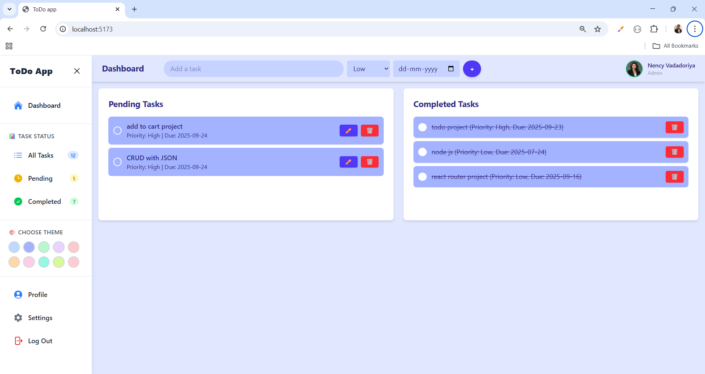
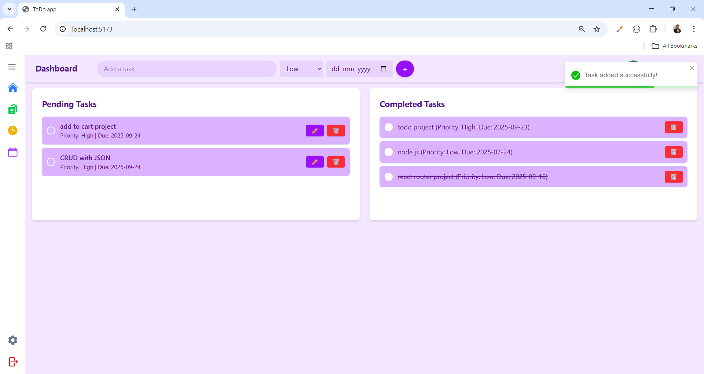
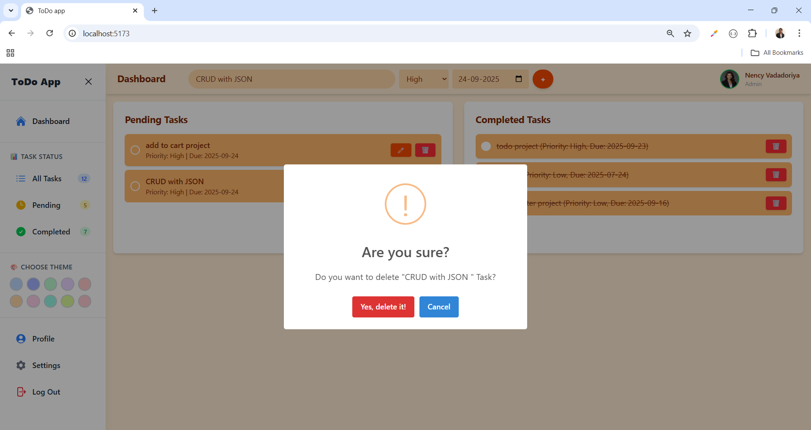
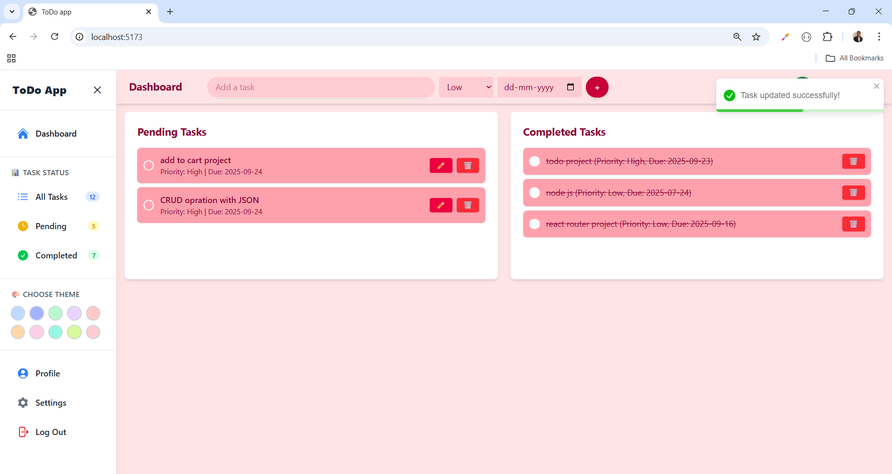
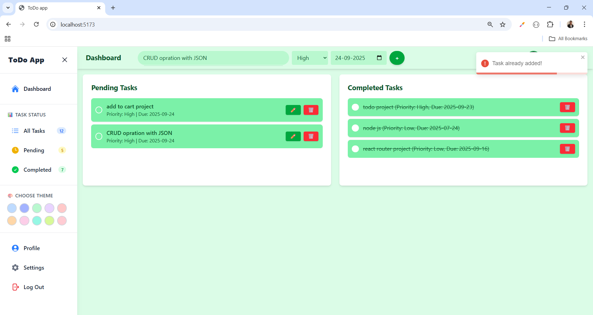

# 📝 ToDo App

A modern and interactive **ToDo Application** built with **React.js**.  
Manage your daily tasks efficiently with features like task priority, due dates, theme switching, and task completion tracking.

---

## 🌟 Features

### ✅ Task Management
- **➕ Add Tasks**: Add tasks with title, priority (Low, Medium, High), and due date.
- **✏️ Edit Tasks**: Modify task details.
- **🗑️ Delete Tasks**: Remove tasks from pending or completed list.
- **✔️ Complete & Undo Tasks**: Mark tasks as completed or move back to pending.
- **⚠️ Prevent Duplicate Tasks**: Avoid adding tasks with same title.

### 📊 Dashboard
- **⏳ Pending Tasks**: Shows all tasks that are yet to be completed.
- **✅ Completed Tasks**: Shows completed tasks separately with strikethrough.

### 🎨 Theme Management
- **🎨 Multiple Theme Colors**: Blue, Indigo, Green, Purple, Red, Orange, Pink, Teal, Lime, Rose.
- **💾 Theme Persistence**: Saves the selected theme in `localStorage`.
- **🖌️ Dynamic Styling**: Backgrounds, text, buttons, and task cards adapt to theme.

### 👤 User Interface
- **🗂 Sidebar Navigation**: Quick access to Dashboard, Task Status, Profile, Settings, and Logout.
- **🔢 Task Counters**: See number of All, Pending, and Completed tasks.
- **📱 Responsive Layout**: Works on desktop and mobile.
- **🔔 Notifications**: Success/error messages with toast notifications.

### 💾 Storage & State Management
- **🗄️ Local Storage**: Tasks persist across page reloads.
- **⚛️ React State Management**: Uses `useState` and `useEffect` to manage tasks, completion, and themes.

---

## 🔗 Social Links

- [💼 LinkedIn](https://www.linkedin.com/in/nency-vadadoriya-3969052ba/)
- [👨‍💻 GitHub](https://github.com/nencyvadadoriya)

---

## 🪪 License

This project is licensed under the [MIT License](https://github.com/nencyvadadoriya/-License/blob/main/LICENSE).

---
📸 Preview

<table>
  <tr>
    <td></td>
    <td></td>
  </tr>
  <tr>
    <td></td>
    <td></td>
  </tr>
  <tr>
    <td></td>
  </tr>
</table>

