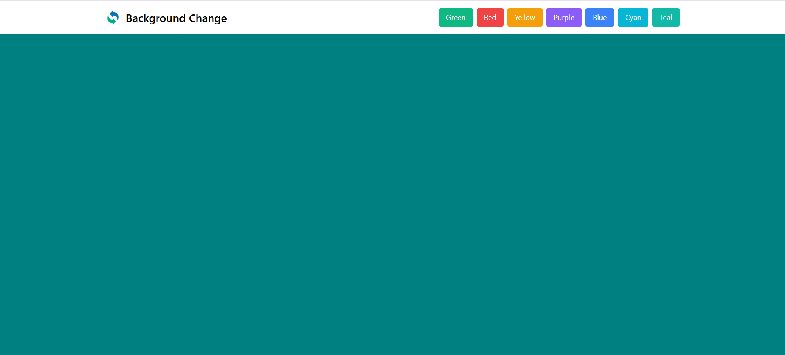

# 🎨 React Background Color Changer App

This is a React-based background color changer application where users can switch the page background to different colors by clicking color buttons. The UI is built with **Tailwind CSS** and **Flowbite** components, ensuring a modern, responsive, and smooth experience.

---

## 🚀 Features

- 🎨 Change background color dynamically
- 🖱 Smooth transition animation
- 📱 Responsive design
- 🧩 Built using React Hooks (`useState`)
- 🎀 Styled with Tailwind CSS + Flowbite
- 💡 Easy to extend with more colors

---

## 🧠 Technologies Used

- **React.js**
- **JavaScript (ES6+)**
- **Tailwind CSS**
- **Flowbite**
- Responsive Design

---

## 📌 How It Works

- A list of color buttons is displayed in the navbar.
- Clicking a button changes the background color to the selected color.
- Transition animation provides a smooth effect between color changes.
- Tailwind CSS handles the styles, and Flowbite enhances the UI components.

---

## 🔗 Social Links

- [💼 LinkedIn](https://www.linkedin.com/in/nency-vadadoriya-3969052ba/)
- [👨‍💻 GitHub](https://github.com/nencyvadadoriya)

---

## 🪪 License

This project is licensed under the [MIT License](https://github.com/nencyvadadoriya/-License/blob/main/LICENSE).

```
MIT License

Copyright (c) 2025 Nency

Permission is hereby granted, free of charge, to any person obtaining a copy
of this software and associated documentation files (the "Software"), to deal
in the Software without restriction, including without limitation the rights 
to use, copy, modify, merge, publish, distribute, sublicense, and/or sell 
copies of the Software, and to permit persons to whom the Software is 
furnished to do so, subject to the following conditions:

THE SOFTWARE IS PROVIDED "AS IS", WITHOUT WARRANTY OF ANY KIND.
```


---
## 📸 Preview



## 🙌 Thanks for visiting!
