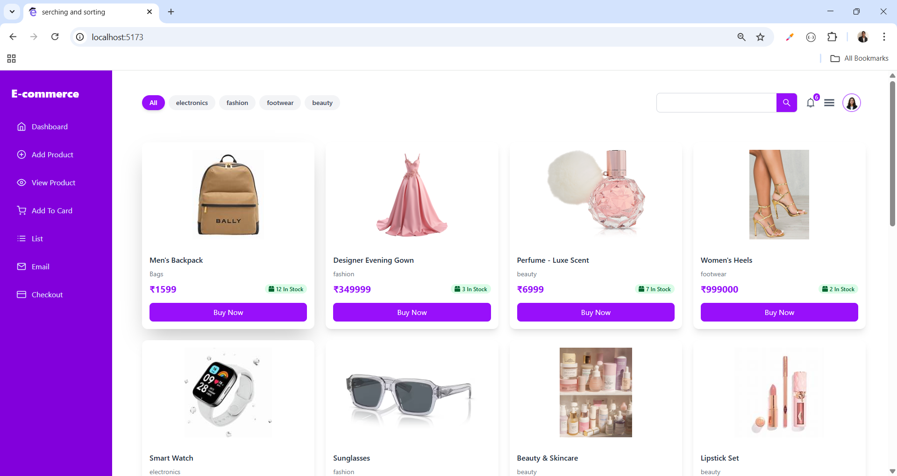
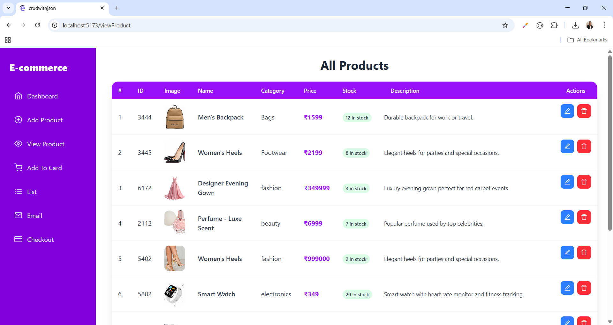
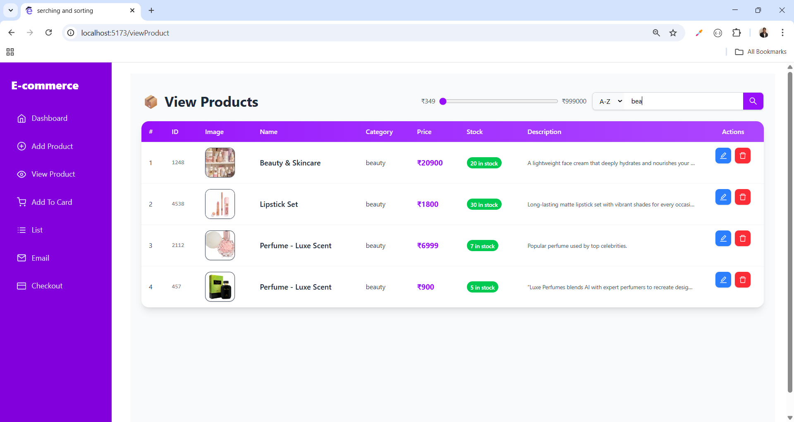
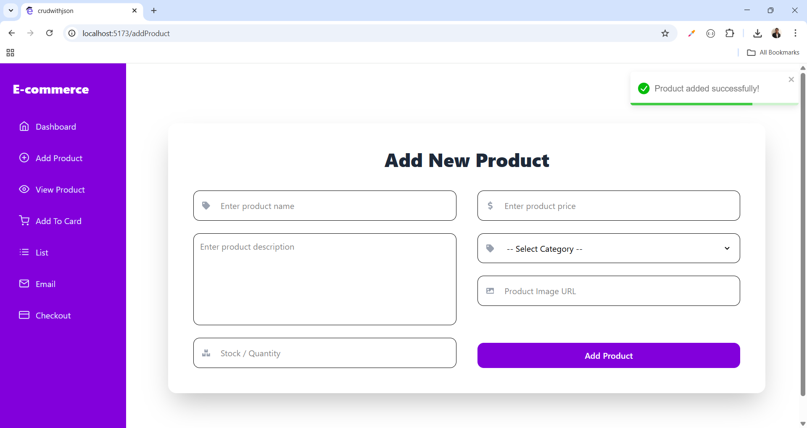
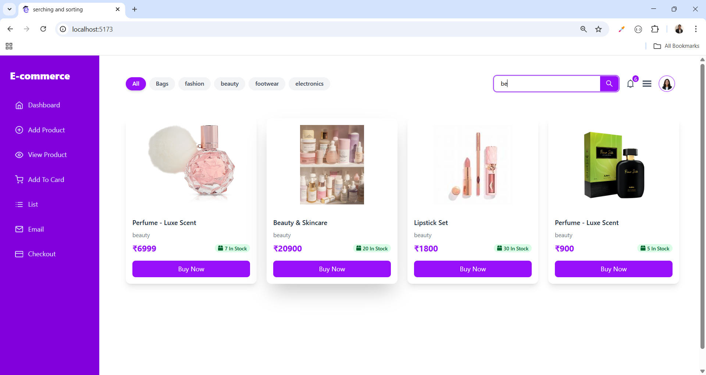
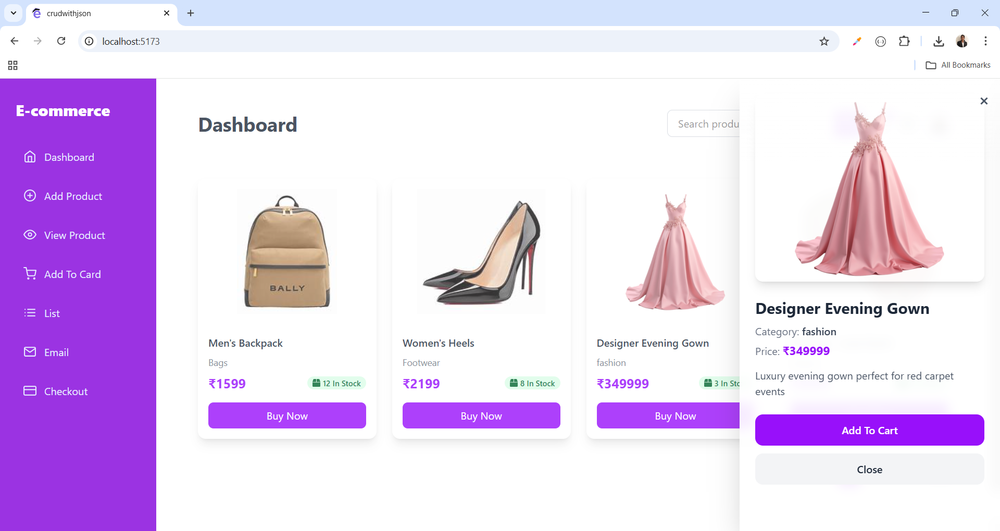
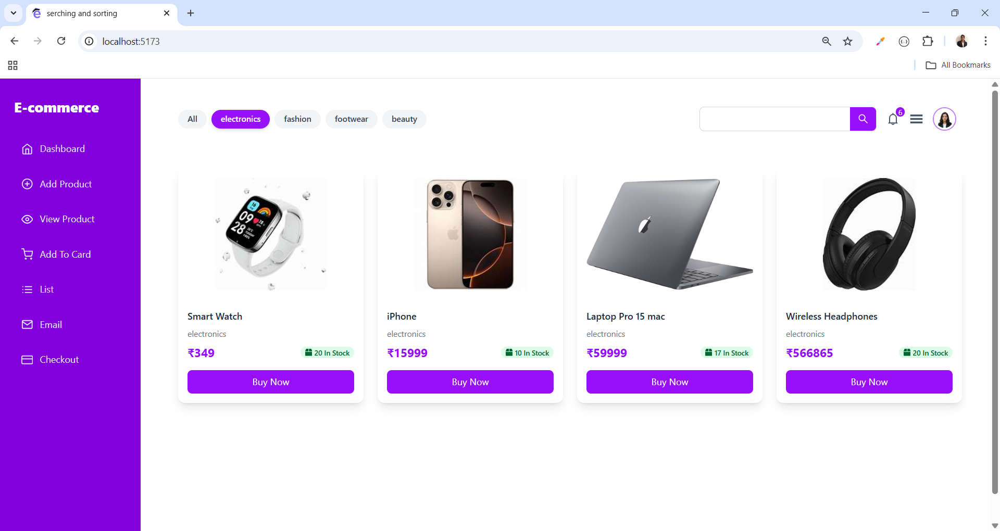
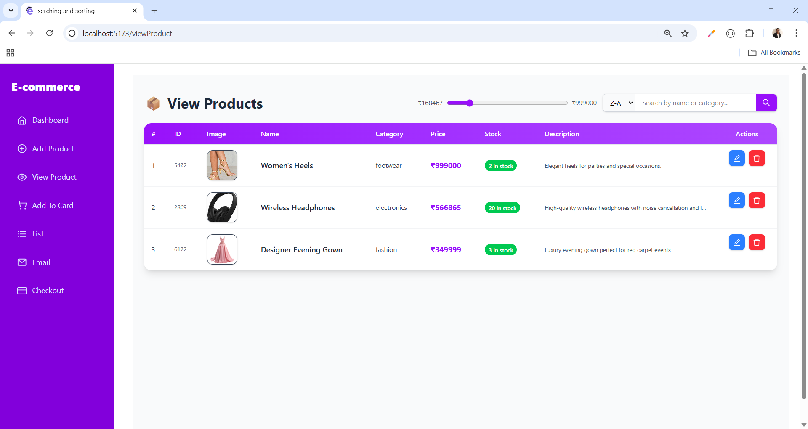

# 🛍️ Product Management Dashboard

A **full-featured Product Management Dashboard** built with **React**, **TypeScript**, and **Tailwind CSS**.  
Supports full **CRUD operations** (Create, Read, Update, Delete), **searching**, **sorting**, **filtering**, **pagination**, and a **sidebar menu**, all within a responsive layout. 🎨

---

## ✨ Features

- 📝 **Add Product:** Create new products with name, category, price, stock status, and image.  
- 👀 **View Products:** Display all products in a responsive grid layout.  
- ✏️ **Update Product:** Edit product details with a pre-filled form.  
- ❌ **Delete Product:** Remove products with confirmation alerts.  
- 🛒 **Add to Cart:** Users can add products to their shopping cart for later checkout.  
- 💳 **Buy Now:** Instantly purchase a product without adding it to the cart.  
- 📄 **Pagination:** Easily navigate through multiple products.  
- 🔍 **Searching:** Quickly find products by name, category, or ID.  
- ↕ **Sorting:** Sort products by price, name, or category in ascending or descending order.  
- 🎯 **Filtering:** Filter products by category or price range for a refined view.  
- 📱 **Responsive Design:** Works on mobile, tablet, and desktop.  
- 🖥️ **Sidebar Navigation:** Toggleable sidebar with smooth overlay.  
- 🔔 **SweetAlert2 Alerts:** Beautiful confirmation alerts for actions like delete or purchase.

---

## 🛠️ Technologies Used

- **Frontend:** React, TypeScript, Tailwind CSS, React Icons  
- **Libraries & Tools:**  
  - SweetAlert2 (Alerts) ⚡  
  - React Router (Routing) 🔀  
  - React Toastify (Notifications) 🔔

---

## 📌 How It Works

1. **Search Bar:** Instantly filters products based on input text (name, category, or ID).  
2. **Sort Options:** Dropdown allows sorting by price (low–high / high–low), name (A–Z / Z–A), or category.  
3. **Filter Panel:** Lets you filter products by category and select a price range dynamically.  
4. **Pagination:** After filtering and sorting, products are paginated for smooth navigation.

---

## 🔗 Social Links

- [💼 LinkedIn](https://www.linkedin.com/in/nency-vadadoriya-3969052ba/)  
- [👨‍💻 GitHub](https://github.com/nencyvadadoriya)  

---

## 🪪 License

This project is licensed under the [MIT License](https://github.com/nencyvadadoriya/-License/blob/main/LICENSE).  

---

📸 **Preview**  

<table>
  <tr>
    <td></td>
    <td></td>
  </tr>
  <tr>
    <td></td>
    <td></td>
  </tr>
  <tr>
    <td></td>
    <td></td>
  </tr>
   <tr>
    <td></td>
    <td></td>
  </tr>
  <tr>
    <td></td>
    <td></td>
  </tr>
</table>

