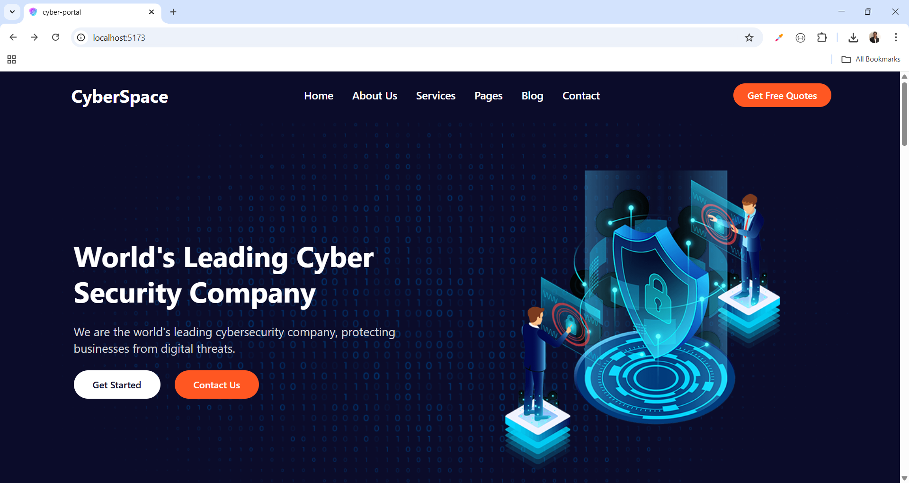
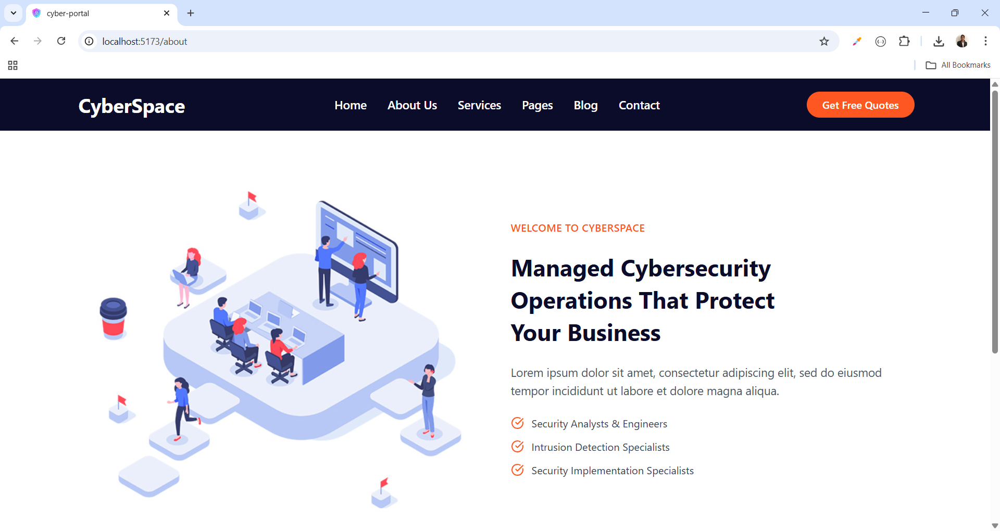
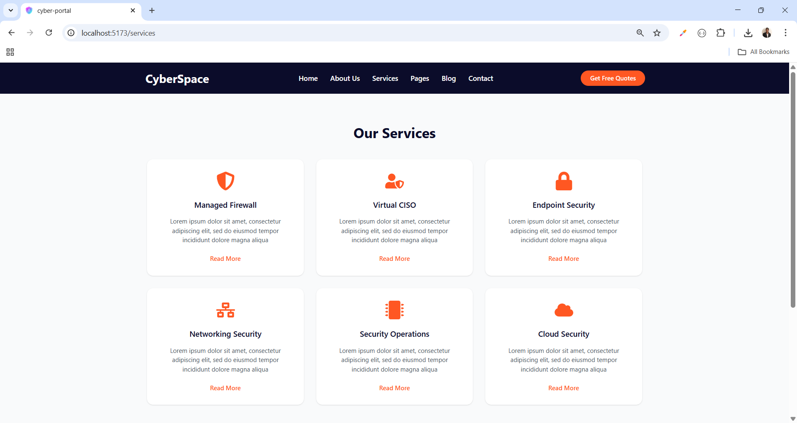
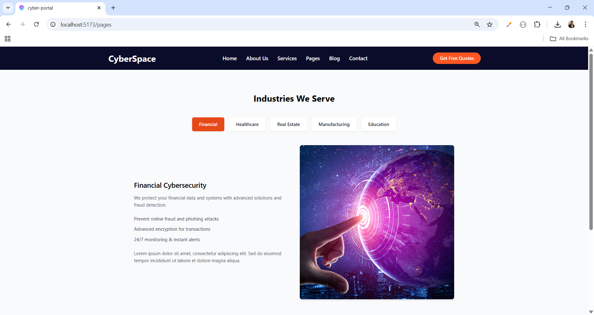
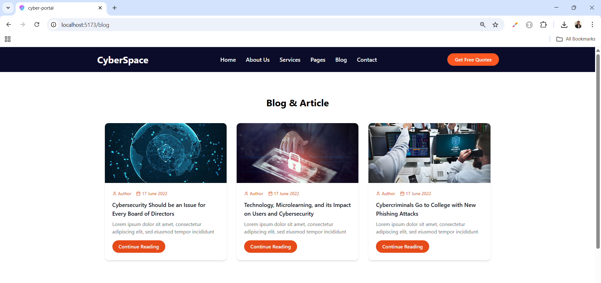
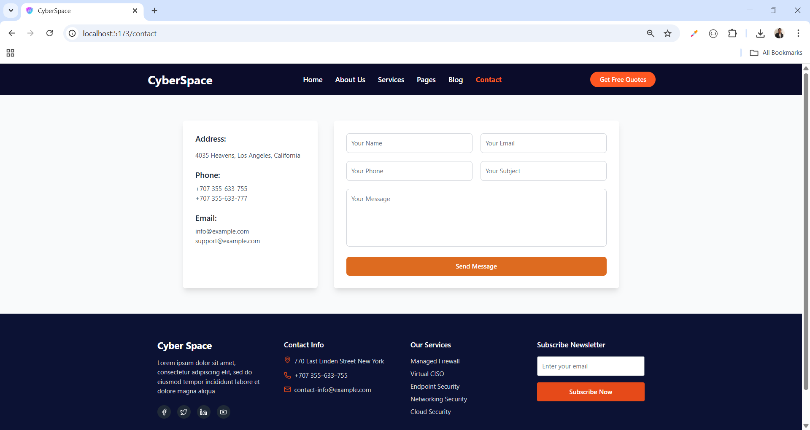

# 🚀 Cyber Portal

A modern **Cyber Security Portal Website** built with **React, Tailwind CSS, Flowbite, and Lucide Icons**.  
This project includes a clean UI design with services, blogs, contact form, and footer section.

---

## 📌 Features
- ✅ Responsive **Navbar** with logo & menu  
- ✅ **Banner** with professional layout  
- ✅ **Our Services Section** (6 services with icons)  
- ✅ **Blog & Articles Section** with images  
- ✅ **Contact Form** (with left contact info + right message form)  
- ✅ **Footer Section** with newsletter subscription  
- ✅ **Favicon Integration**  
- ✅ Built with **React + Vite + Tailwind + Flowbite**  

---

## 🛠️ Tech Stack
- **React** (Vite)
- **Tailwind CSS**
- **Flowbite React**
- **Lucide React Icons**

---
## 🔗 Social Links

- [💼 LinkedIn](https://www.linkedin.com/in/nency-vadadoriya-3969052ba/)
- [👨‍💻 GitHub](https://github.com/nencyvadadoriya)

---

## 🪪 License

This project is licensed under the [MIT License](https://github.com/nencyvadadoriya/-License/blob/main/LICENSE).

---
📸 Preview

<table>
  <tr>
    <td></td>
    <td></td>
  </tr>
  <tr>
    <td></td>
    <td></td>
  </tr>
  <tr>
    <td></td>
    <td></td>
  </tr>
</table>

---
