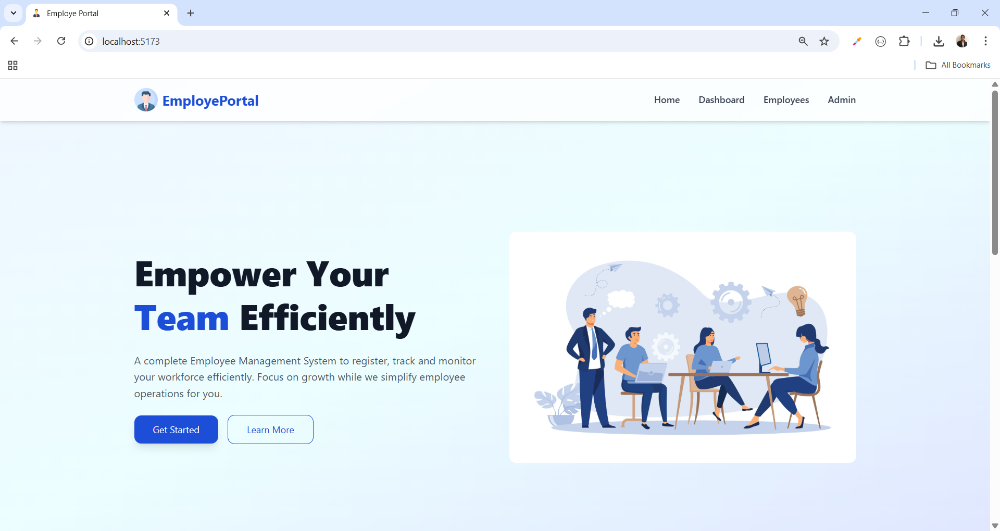
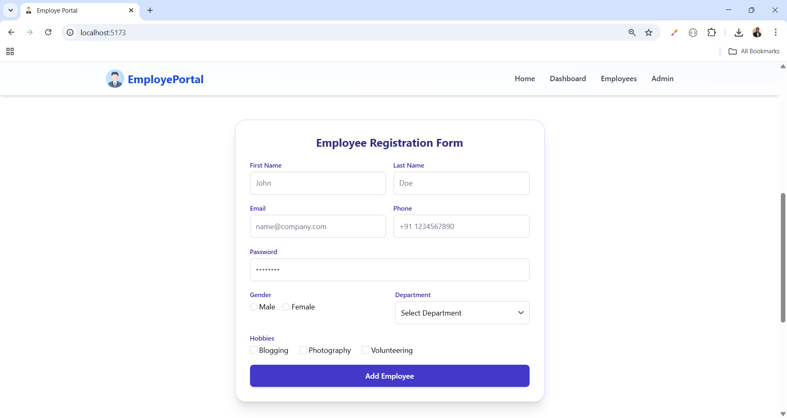
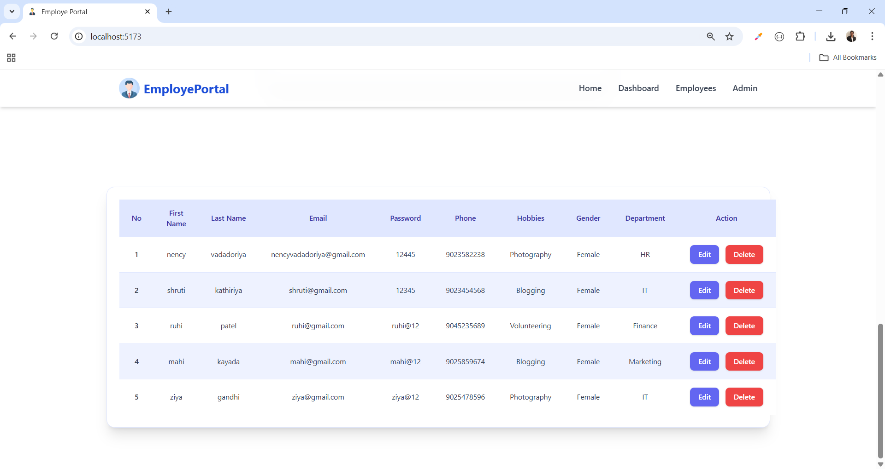
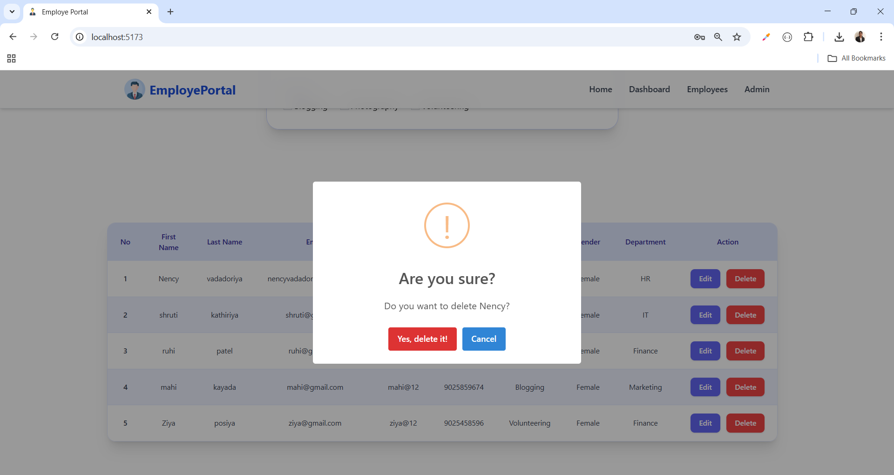
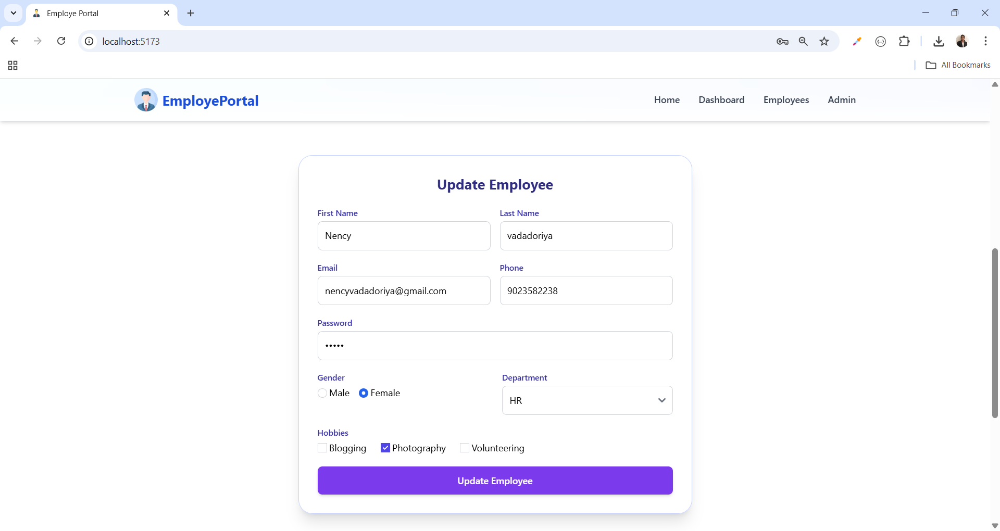
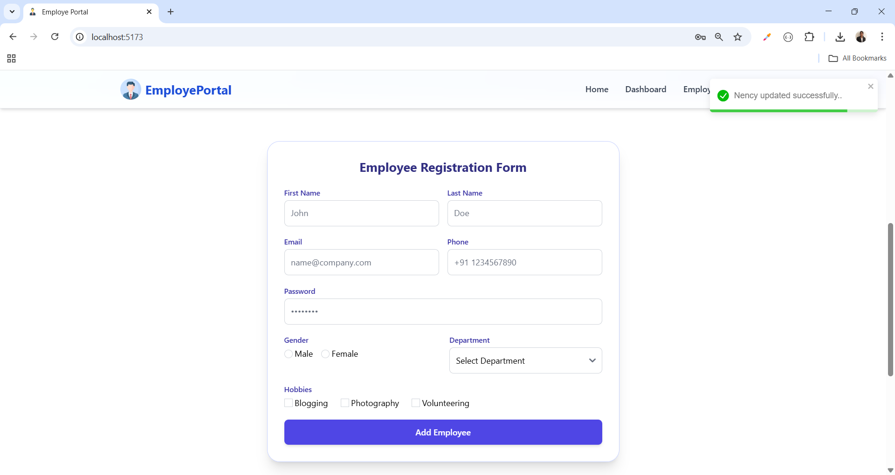

# Employee Portal 🚀

A modern and professional **Employee Management Portal UI** built with **React + Tailwind CSS**.  
This project includes a **premium navbar** and a **corporate-style hero banner** with employee-related illustrations.  

---

## 📌 Features
- ✅ Responsive **Navbar** with logo & menu links  
- ✅ Clean **Hero Banner** with headline, tagline, CTA buttons  
- ✅ Professional employee-related **illustration**  
- ✅ Tailwind CSS for modern design & easy customization  
- ✅ Mobile-friendly (hamburger menu for small screens)  

---

## 🛠️ Tech Stack

- **React** (with functional components)
- **TypeScript** (for type safety)
- **Tailwind CSS** (for styling)
- **Vite** (recommended build tool)

## 🔗 Social Links

- [💼 LinkedIn](https://www.linkedin.com/in/nency-vadadoriya-3969052ba/)
- [👨‍💻 GitHub](https://github.com/nencyvadadoriya)

---

## 🪪 License

This project is licensed under the [MIT License](https://github.com/nencyvadadoriya/-License/blob/main/LICENSE).

```

## 🖼️ Preview







---
