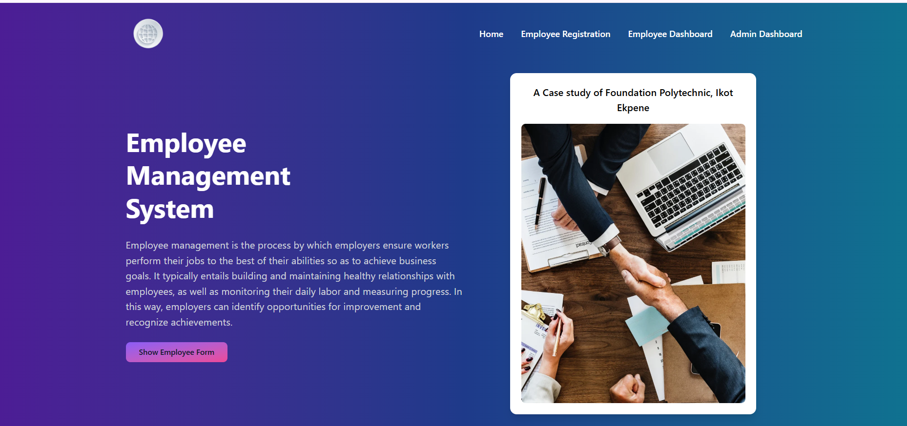
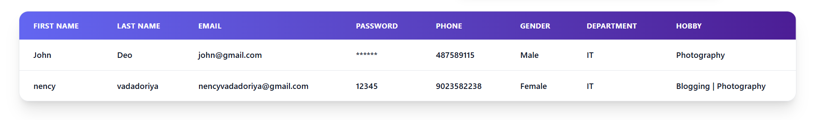
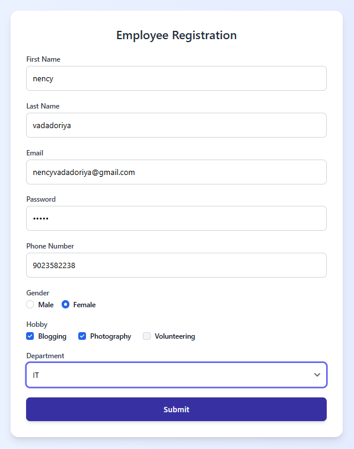
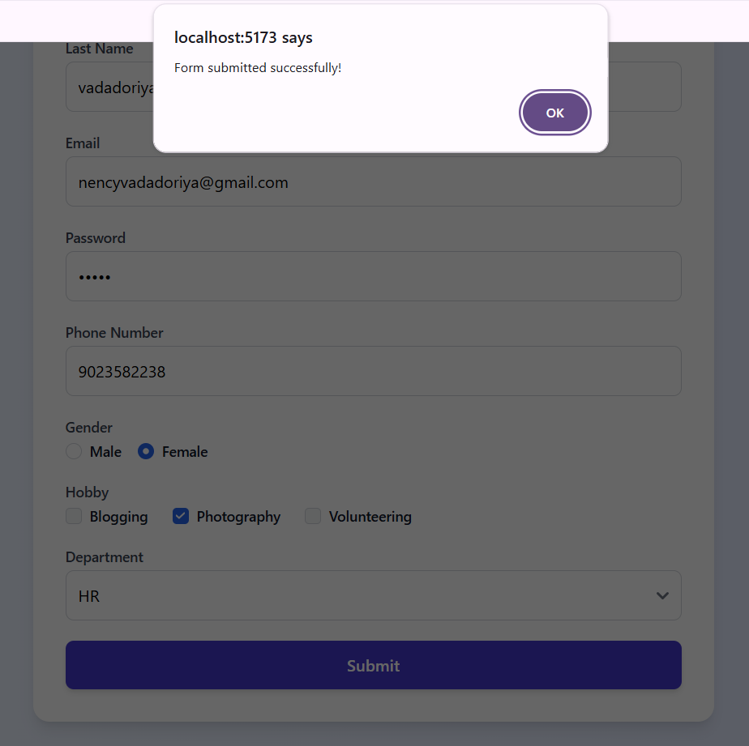

# Employee Management System

A simple **Employee Management System** built with **React, TypeScript, and Tailwind CSS**.  
This project demonstrates the use of React components, TypeScript for type safety, Tailwind CSS for styling, and state management with React Hooks.

---

## 🚀 Features

- 📌 **Navbar with Hero Section**
  - Responsive navigation bar with links.
  - Hero section introducing the Employee Management System.
- 📝 **Employee Registration Form**
  - Collects employee details: First Name, Last Name, Email, Password, Phone, Gender, Department, and Hobbies.
  - Input validation with React state management.
  - Supports multiple hobbies using checkboxes.
- 📊 **Employee Dashboard Table**
  - Displays registered employee details.
  - Toggle between form view and table view.
- 🎨 **Styling**
  - Fully responsive design using Tailwind CSS.
  - Dark mode compatible styles included.
- ⚡ **State Management**
  - Built with React Hooks (`useState`) for handling form data.
  - Form submit clears data and displays it in a table.

---

## 🛠️ Tech Stack

- **React** (with functional components)
- **TypeScript** (for type safety)
- **Tailwind CSS** (for styling)
- **Vite** (recommended build tool)


## 🔗 Social Links

- [💼 LinkedIn](https://www.linkedin.com/in/nency-vadadoriya-3969052ba/)
- [👨‍💻 GitHub](https://github.com/nencyvadadoriya)

---

## 🪪 License

This project is licensed under the [MIT License](https://github.com/nencyvadadoriya/-License/blob/main/LICENSE).

```
MIT License

Copyright (c) 2025 Nency

Permission is hereby granted, free of charge, to any person obtaining a copy
of this software and associated documentation files (the "Software"), to deal
in the Software without restriction, including without limitation the rights 
to use, copy, modify, merge, publish, distribute, sublicense, and/or sell 
copies of the Software, and to permit persons to whom the Software is 
furnished to do so, subject to the following conditions:

THE SOFTWARE IS PROVIDED "AS IS", WITHOUT WARRANTY OF ANY KIND.
```


---
## 📸 Preview  

<div align="center">
  
  
  
  
  
</div>

## 🙌 Thanks for visiting!