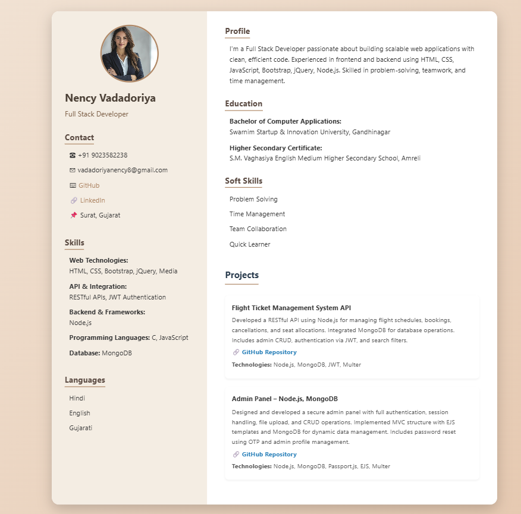

# 💼 Responsive Animated Resume 

A fully responsive, animated resume built with **HTML, CSS, and React** showcasing personal, educational, and professional details. Designed to reflect both technical proficiency and clean aesthetics.
## 🚀 Features

- 📱 Fully responsive (desktop)
- 🎨 Smooth fade-in animations
- 👤 Personal Information Section
- 🎓 Education  Details
- 🧠 Technical Skills & Soft Skills
- 🌐 Languages and Contact Info included
- ⚛️ Built using **React**, external **CSS**, and animated transitions
    ## 📝 About This Resume

This is a **responsive, animated resume** built using **React** and **external CSS**, designed to showcase my personal and professional journey in a clean and modern layout. The aim of this project is to present a digital version of my resume that not only highlights my **education**, **skills**, and **experience**, but also demonstrates my ability to build responsive and visually appealing front-end applications.

### 🔍 Why I Created This:
- To present my resume in an interactive and modern way.
- To showcase my **React.js** and **CSS animation** skills.
- To create a project that reflects both my **technical skills** and **design sense**.

### 📂 Included Sections:
- Personal Information
- Education History
- Technical Skills & Soft Skills
- Languages Known
- Contact Information

This resume is fully responsive and can be viewed across different screen sizes. It is suitable for use in **developer portfolios**, **job applications**, or as a base template for others to customize.

---
## 🧠 Technical Skills
- HTML5
- CSS3
- JavaScript (ES6+)
- React.js
- Responsive Design

---
## 🔗 Links

- 💼 [LinkedIn](https://www.linkedin.com/in/nency-vadadoriya-3969052ba/)
- 👨‍💻 [GitHub](https://github.com/nencyvadadoriya)
- 📍 Surat, Gujarat
- ✉️ vadadoriyanency8@gmail.com
- ☎️ +91 9023582238

## 🖼️ Preview

