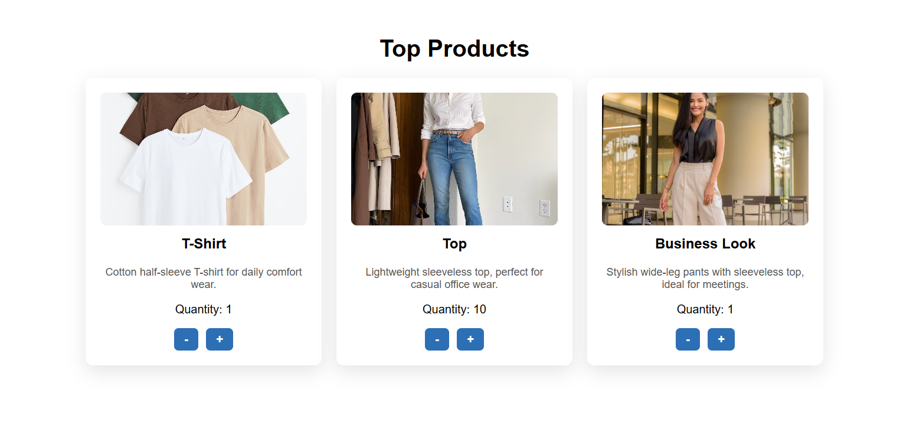

# 🛒  React Product Quantity Counter App

This is a React-based product quantity counter application where users can adjust the quantity of individual items using plus (+) and minus (−) buttons. The system ensures that the quantity stays within a defined range (1 to 10). It uses React hooks (useState), clean UI with CSS styling, and alerts users when limits are exceeded.

---

## 🚀 Features
- 📦 Add to cart functionality
- ➕➖ Increase / Decrease item quantity
- 🔟 Maximum item limit: 10
- 🧊 Minimum quantity: 1
- ⚠️ Alerts on limit exceed
- 🧠 Clean and responsive UI
- 💅 External CSS styling
- ⚛️ Built with React functional components and hooks

---

## 🧠 Technologies Used

- React.js
- JavaScript (ES6+)
- CSS3
- Responsive Design

---

## 📌 How It Works

- A user clicks on **Add to Cart** to add an item.
- Quantity starts from **1**.
- Clicking **+** increases the quantity up to **10**.
- Clicking **-** decreases it but won't go below **1**.
- If max or min is hit, the user gets an alert.
---

## 🔗 Social Links

- [💼 LinkedIn](https://www.linkedin.com/in/nency-vadadoriya-3969052ba/)
- [👨‍💻 GitHub](https://github.com/nencyvadadoriya)

---

## 🪪 License

This project is licensed under the [MIT License](https://github.com/nencyvadadoriya/-License/blob/main/LICENSE).

```
MIT License

Copyright (c) 2025 Nency

Permission is hereby granted, free of charge, to any person obtaining a copy
of this software and associated documentation files (the "Software"), to deal
in the Software without restriction, including without limitation the rights 
to use, copy, modify, merge, publish, distribute, sublicense, and/or sell 
copies of the Software, and to permit persons to whom the Software is 
furnished to do so, subject to the following conditions:

THE SOFTWARE IS PROVIDED "AS IS", WITHOUT WARRANTY OF ANY KIND.
```


---
## 📸 Preview



## 🙌 Thanks for visiting!
