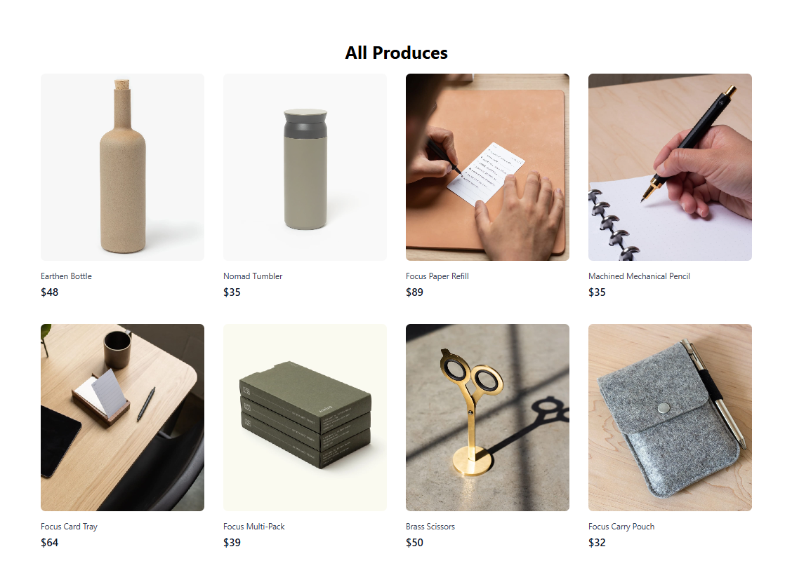

# 🛍️  Tailwind CSS Product Page

This is a responsive **Product Page** built using **React** and **Tailwind CSS**.  
It displays product cards with images, names, and prices in a clean, modern design.  
The layout is fully responsive and optimized for both mobile and desktop devices.

---

## 🚀 Features
- 📱 Fully responsive design
- 🖼️ Product images with descriptions
- 💲 Price display
- 🎨 Styled using Tailwind CSS utility classes
- ⚛️ Built with React functional components
- 🧩 Easy to customize and extend

---

## 🧠 Technologies Used

- React.js
- Tailwind CSS
- JavaScript (ES6+)
- Responsive Design Principles

---

## 📌 How It Works

- Products are stored in an array inside the React component.
- Each product has:
  - **Image**
  - **Name**
  - **Price**
- Tailwind utility classes handle spacing, colors, fonts, and responsiveness.
- The layout adapts automatically for mobile, tablet, and desktop.

---

## 🔗 Social Links

- [💼 LinkedIn](https://www.linkedin.com/in/nency-vadadoriya-3969052ba/)
- [👨‍💻 GitHub](https://github.com/nencyvadadoriya)

---

## 🪪 License

This project is licensed under the [MIT License](https://github.com/nencyvadadoriya/-License/blob/main/LICENSE).

## 📸 Preview

---

## 🙌 Thanks for visiting!

