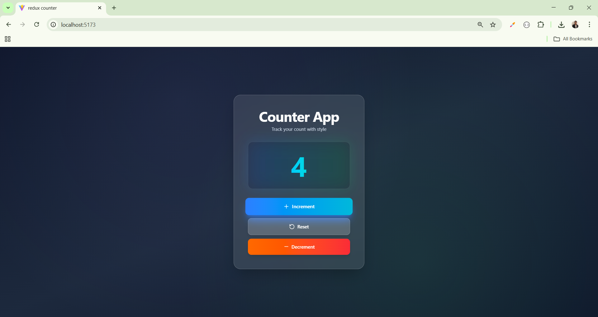

# 🧮 Redux Counter App

A simple **Counter Application** built with **React** and **Redux** to demonstrate global state management using Redux Toolkit.

---

## 🚀 Features

- Increment and Decrement the counter  
- Reset the counter to zero  
- Centralized state management using Redux Toolkit  
- Clean and minimal UI  
- Easy to extend and customize

---

## 🛠️ Tech Stack

- **React** – Frontend library  
- **Redux Toolkit** – For state management  
- **React-Redux** – To connect Redux with React components  
- **Vite / Create React App** – (depending on your setup) for development

---
## 🔗 Social Links

- [💼 LinkedIn](https://www.linkedin.com/in/nency-vadadoriya-3969052ba/)  
- [👨‍💻 GitHub](https://github.com/nencyvadadoriya)  

---

## 🪪 License

This project is licensed under the [MIT License](https://github.com/nencyvadadoriya/-License/blob/main/LICENSE).  

---

📸 **Preview**  

<table>
  <tr>
    <td></td>
  </tr>
</table>

