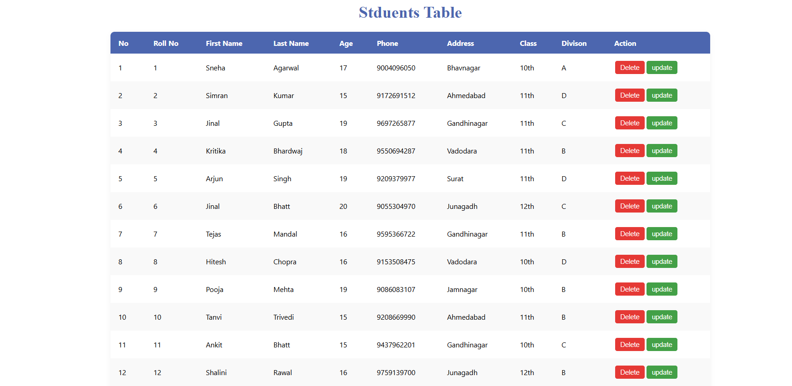

# 📊 React Table Using State

This is a simple **React Table** project where table data is stored and managed using React's `useState` hook.  
It allows you to display data dynamically and easily update or modify rows.

---

## 🚀 Features
- 📄 Display tabular data
- 🔄 Managed completely with React state
- ➕ Add new rows dynamically
- 🗑️ Delete rows from the table
- 🎨 Clean and responsive UI using basic CSS

---

## 🧠 Technologies Used
- React.js
- JavaScript (ES6+)
- CSS3
- HTML5

---

## 📌 How It Works
1. Table data is stored in a state variable.
2. You can add or remove rows dynamically.
3. The table re-renders whenever state changes.
4. Clean layout for better readability.

---

## 🔗 Social Links

- [💼 LinkedIn](https://www.linkedin.com/in/nency-vadadoriya-3969052ba/)
- [👨‍💻 GitHub](https://github.com/nencyvadadoriya)

---

## 🪪 License

This project is licensed under the [MIT License](https://github.com/nencyvadadoriya/-License/blob/main/LICENSE).

## 📸 Preview

---

## 🙌 Thanks for visiting!

