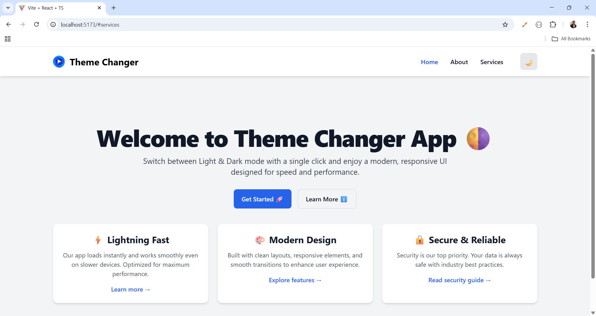

# 🌗 React Theme Changer (Light & Dark Mode)

यह प्रोजेक्ट एक simple **Light/Dark Theme Toggle** दिखाता है।  
User एक बटन दबाकर theme बदल सकता है और चुना हुआ theme **localStorage** में save होता है।  

---

## 🚀 Features
- 🌞 Light Mode  
- 🌙 Dark Mode  
- 💾 Theme save in LocalStorage  
- ⚡ React Hooks (`useState`, `useEffect`)  
- 🎨 Easy to style with TailwindCSS / Custom CSS 

---  
## 🪪 License

This project is licensed under the [MIT License](https://github.com/nencyvadadoriya/-License/blob/main/LICENSE).

---
📷 Demo Preview
    
    (./src/assets/img-1.png)

    ## 🙌 Thanks for visiting!
